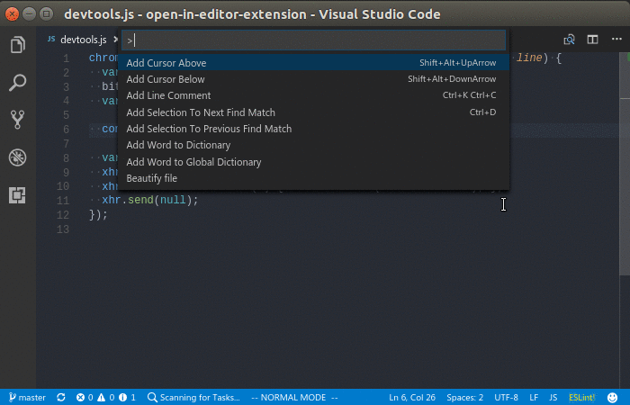

# Open in Editor extension for Visual Studio Code

The extension enables you to open a file in an alternative IDE or editor.

Editor support:

-   [Atom Editor](https://atom.io/)
-   [Emacs](https://www.gnu.org/software/emacs/)
-   [IDEA 14 Community Edition](https://www.jetbrains.com/idea/download/)
-   [Sublime Text](http://www.sublimetext.com/)
-   [PhpStorm](https://www.jetbrains.com/phpstorm/)
-   [Vim](http://www.vim.org/)
-   [Visual Studio](https://www.visualstudio.com/)
-   [WebStorm](https://www.jetbrains.com/webstorm/)

You also can use any other editor that is able to open files from command line.

## Features

-   Editor context menu
-   File Explorer context menu
-   Put a cursor in the same position.

Use the menu in the editor's tab or the explorer or just press F1 and type `Open in External Editor`. The selected file will be opened in an existing session of an alternative editor and put a cursor in the same position as it was in VS Code.

## Keyboard Shortcut

You can also use `Alt+Shift+E` to open the file in the alternative editor.

## Extension Settings

This extension contributes the following settings:

**`alt-editor.name`**: a string name of an editor.

Supported names are:

| Name           | Editor                                      |
| -------------- | ------------------------------------------- |
| `atom`         | Atom Editor                                 |
| `emacs`        | Emacs (via Terminal, Mac OS and Linux only) |
| `idea14ce`     | IDEA 14 CE                                  |
| `phpstorm`     | PhpStorm                                    |
| `sublime`      | Sublime Text                                |
| `vim`          | Vim (via Terminal, Mac OS and Linux only)   |
| `visualstudio` | Visual Studio                               |
| `webstorm`     | WebStorm                                    |

### Advanced settings

Use these setting if the editor currently is not supported or if the editor's path can't be detected automatically.

**`alt-editor.binary`**: a string path to the editor binary

**`alt-editor.args`**: a string of command line arguments which will be passed to the `binary`. The `args` can contain placeholders to be replaced by actual values. Supported placeholders: `{filename}`, `{line}` and `{column}`

**`alt-editor.terminal`**: set this to `true` if the editor should be opened in a terminal. Mac OS and Linux are supported.

### Examples:

#### Visual Studio

Use the Visual Studio IDE as an alternative editor.

    "alt-editor.name": "visualstudio"

#### Vim

Override the default `vim` arguments to open files in the tabs in the same instance.

    "alt-editor.name": "vim",
    "alt-editor.args": "--servername Code --remote-tab-silent \"+call cursor({line}, {column})\" {filename}"

The VIM should be compiled with `+clientserver` flag. Run the `vim --version` and check the output.

## Release Notes

### 0.9.0

Initial release of the extension.

* * *

### For more information

-   Powered by [open-in-editor](https://github.com/lahmatiy/open-in-editor)

**Enjoy!**
